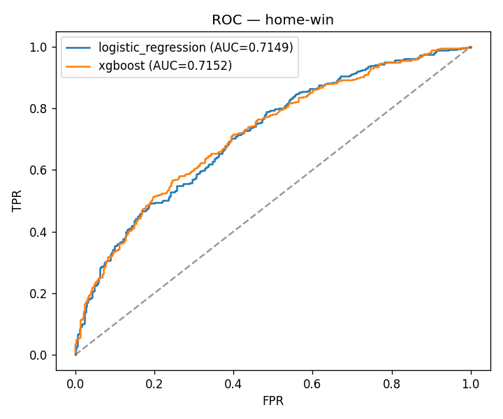
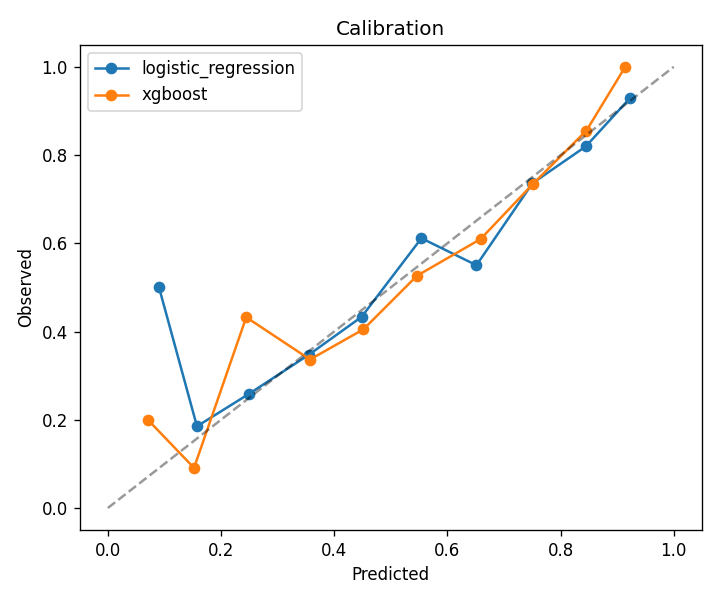
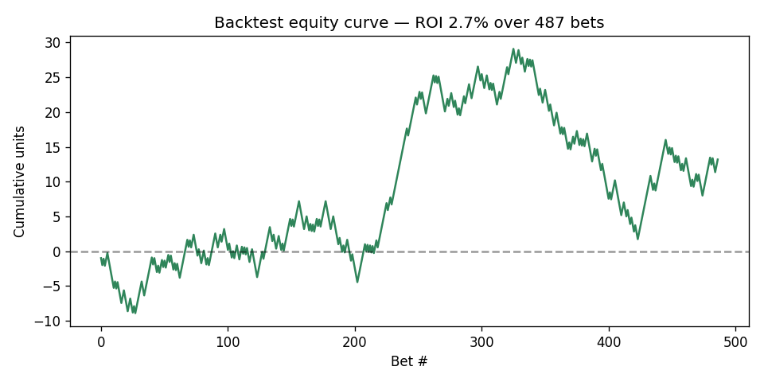

# 🏀 NBA Game Outcome Predictor

End-to-end machine-learning system that predicts NBA game winners **before tip-off**, then **backtests the predictions as a betting strategy** against a ratings-only market. Built to show leakage-free feature engineering, time-aware model selection, probability calibration, and an honest evaluation that goes beyond accuracy.

[](https://github.com/danielduongg/nba-game-predictor/actions)

> **Reproducible by design.** A realistic game simulator ships with the repo, so `python main.py` runs the entire pipeline — hyperparameter search, calibration, evaluation, and backtest — in well under a minute with no API keys. Swap in real data from `nba_api` anytime (see below).

## What makes it more than a toy

- **Time-aware hyperparameter search** — `RandomizedSearchCV` over XGBoost with a `TimeSeriesSplit` (never trains on the future).
- **Probability calibration** — Platt-scaled logistic regression + a reliability curve; we report **Brier skill score**, not just accuracy.
- **Permutation importance** — model-agnostic, computed on the held-out set.
- **Betting backtest** — converts probabilities into flat bets at −110 odds against a *calibrated Elo-only "market,"* with ROI, hit rate and an equity curve.
- **Inference CLI** (`predict.py`), **pytest** suite, **GitHub Actions CI**, **Dockerfile**, and structured logging.

## Results (held-out final season)

| Model | Accuracy | ROC-AUC | Log-loss | Brier | Brier skill |
|---|---|---|---|---|---|
| Logistic Regression (calibrated) | **0.671** | 0.715 | 0.612 | 0.212 | **0.136** |
| XGBoost (tuned) | 0.658 | **0.715** | 0.611 | 0.212 | 0.136 |
| Baseline: always pick home | 0.569 | – | – | – | – |




Both models beat the home-pick baseline by ~10 points; the probabilities are well-calibrated (right curve), and the positive **Brier skill score** confirms the forecasts add information over the base rate.

## The backtest: does it have *edge*?

The model places a flat 1-unit bet at −110 whenever its probability diverges by >3% from a **calibrated Elo-only market** — i.e., only when it knows something the rating-based price doesn't.

| Bets | Bet rate | Hit rate | Breakeven | ROI | Net units |
|---|---|---|---|---|---|
| 487 | 56% | **0.538** | 0.524 | **+2.7%** | +13.2 |



The edge is **thin but real**: the model clears the −110 breakeven (0.538 > 0.524) almost entirely by exploiting **rest and back-to-back** information the ratings-only market ignores. That's the honest reality of sports modeling — small edges, and the vig is the enemy.

> ⚠️ Synthetic data; this demonstrates backtest *methodology*, not real-world profitability.

## How it works
```
simulate.py  ->  features.py  ->  model.py  ->  backtest.py
 raw games      leakage-free      tune + calibrate   ROI vs. market
                Elo/form/rest     + evaluate
```
Every feature for a game uses **only** prior games: an online, margin-weighted **Elo**, rolling **form** and **net rating**, and **rest / back-to-back** flags. Validation is a strict **time split** (train on past seasons, test on the most recent).

## Quickstart
```bash
pip install -r requirements.txt
python main.py                 # simulate, tune, train, evaluate, backtest
python main.py --no-tune       # faster (skip hyperparameter search)
python predict.py --home BOS --away LAL --home-elo 1620 --away-elo 1555
pytest -q                      # run the test suite
make docker                    # build + run in Docker
```

## Using real NBA data
Replace `simulate.py` with a [`nba_api`](https://github.com/swar/nba_api) pull reshaped to the same columns (`home_team, away_team, date, home_pts, away_pts, home_win, home_rest, away_rest`); `features.py` → `model.py` → `backtest.py` run unchanged.

## Tech
Python · scikit-learn · XGBoost · pandas · matplotlib · pytest · Docker · GitHub Actions

## Layout
```
├── simulate.py        # reproducible game generator
├── features.py        # leakage-free Elo / form / rest features
├── model.py           # hyperparameter search, calibration, permutation importance
├── backtest.py        # betting backtest vs. a calibrated market
├── predict.py         # single-matchup inference CLI
├── main.py            # end-to-end orchestrator
├── test_*.py          # pytest suite
├── reports/           # metrics, plots, equity curve
├── Dockerfile · Makefile · requirements.txt
└── .github/workflows/ci.yml
```
